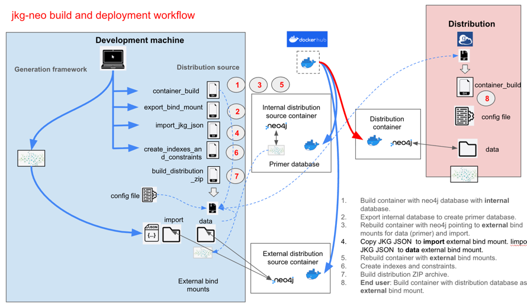

# jkg-neo4j
jkg-neo4j: tools to build a containerized neo4j instance of data 
imported from a file that conforms to the [JSON Knowledge Graph (JKG)](https://github.com/x-atlas-consortia/json-knowledge-graph) schema.

# Background

## JKG format
The JKG format is intended to support platform-agnostic transfers of
knowledge graphs. A file that conforms to the JKG JSON schema is called a JKG JSON file.

It should be possible:
+ to import data from a JKG JSON file into a graph database
+ to export data from a graph database to a JKG JSON file

## Dockerized neo4j distributions
A useful method to demonstrate the features of a knowledge graph is to provide the graph 
as part of a distribution that includes a fully-functional instance of a graph database application 
configured to work with the knowledge graph.

If a distribution of a graph database application with its data is in a container such as Docker, 
users only need the container management application to run the graph database on local machines.

The tools in **jkg-neo4j** support the building of a Docker container host of
an instance of neo4j Community Edition, containing a graph database imported from a JKG JSON. 

The container can be distributed as a "turnkey" Zip archive. Users instantiate a local copy of the
distribution by unzipping the archive and running a single command. Users would be able to export data 
from the distribution's graph database to a file in JKG format.

# Architecture
The **jkg-neo4j** architecture comprises:
* a Docker image in Docker Hub running neo4j Community Edition
* a Docker Compose configuration
* a suite of custom Shell and Python scripts

The architecture supports both building a turnkey distribution from source and installing the 
distribution locally.

# Build Workflow

# Deployment Workflow
