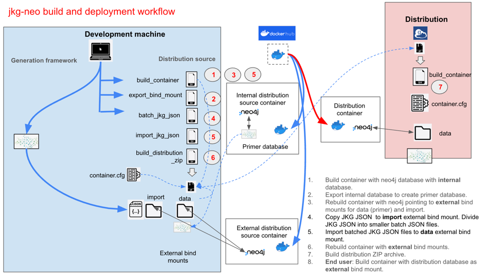

# JSON Knowledge Graph (JKG) 

# Instructions for building the Docker jkg-neo4j Distribution


Building a JKG neo4j distribution involves a complicated workflow that generates a
neo4j database as an external bind mount for a Docker container that hosts
an instance of neo4j.

# Background
## Goals
The goals of the development infrastructure include:
1. Encapsulating workflow functions in modular shell scripts.
2. Keeping JKG JSON files of potentially licensed content out of public Docker containers.
3. Using a build script that can be used for both build and deployment.
4. Optimizing deployment by generating all indexes and constraints at build time.
5. Keeping the end user's actual deployment as simple as possible.

## Basic workflow
The objective of the build workflow is to build a complete and performant JKG neo4j database that 
will not be contained in the public Docker image. To acheive this objective, the workflow:
- starts with the empty default database that is part of the installation of neo4j
- uses this database as a "primer"
- exports the primer database to be an external bind mount of a Docker container
- creates indexes and constraints in the JKG database
- converts the primer database into a JKG database by importing a source JKG JSON into the primer

The following image illustrates the workflow. 
The steps of the workflow follow.


# Prerequisites for building

## Set up host machine
The host machine's specifications include:
- Mac OSX or Linux 
- Minimum of 32 GB RAM
- Free disk space equal to 3-4 times the size of the source JKG JSON
- Docker installed
- git installed
- a git clone of the **jkg-neo4j** repository

### Python
The workflow includes execution of the Python script **import_jkg_json.py** that imports data from a JKG JSON file into the neo4j instance.

If the Python script will be used, install Python (version >= 3.13) on the development machine. 

### neo4j memory recommendations
The recommended values for server memory in **neo4j.conf**
depend on the development machine.

The default recommendations in the _CUSTOM MEMORY Settings_ section of **neo4j.conf** 
are based on the following use case:
1. Developer machine: 
   - MacBook Pro
   - Apple M1 Max processor
   - 32 GB RAM
2. Docker
3. neo4j server
   - Community Edition
   - version >= 5.15
4. JKG based on 2025AB UMLS

Recommendations:
```azure
server.memory.heap.initial_size=5000m
server.memory.heap.max_size=5000m
server.memory.pagecache.size=6700m
```

#### Changing memory configuration
Neo4j memory configuration is complex. Neo4j provides [extensive recommendations](https://neo4j.com/docs/operations-manual/current/performance/memory-configuration/) for memory configuration. 
General recommendations are available through sources that include GitHub Copilot.

The simplest option for obtaining an optimal memory configuration is to run **[neo4j-admin server memory-recommendation](https://neo4j.com/docs/operations-manual/current/configuration/neo4j-admin-memrec/)** for the neo4j instance.
To do this in a Dockerized jkg-neo instance,
1. "Step into" the Docker container with the command `docker exec -it <name of container> bash`.
2. Execute `./neo4j-admin server memory-recommendation`.
3. Modify the custom memory values in both **neo4j.conf** and **neo4j.conf.noauth**.
4. Rebuild the Docker image as described in the **README.md** file in the _docker_ directory.

#### Special case: import issues
The use of **neo4j-admin server memory-recommendation** assumes that the neo4j database contains data.

One known case of potential memory issues involves the import of relationships. If the import fails, the 
neo4j instance may not contain a database that can be used to obtain memory recommendations.

If an import fails because of memory issues with the import of relationships, it may be possible to determine an optimal  
memory allocation, based on a partial import of just nodes. To import just the nodes into the jkg-neo4j instance, 
set _import_rels_=false in **container.cfg**.
Once the import completes, use **neo4j-admin server memory-recommendation** as described above.

## Obtain JKG JSON file
After generating a JSON that conforms to the JKG schema, copy the JKG JSON into a subdirectory of the application directory 
named _/json_. 

# jkg-neo4j Repository content
## docker directory
The **docker** directory contains source used to build a Docker image that will be published in Docker Hub.
Refer to the README.md file in the _/docker_ directory for more information.

## scripts
The **scripts** folder contains:
- the set of Shell scripts (and optional Python scripts) used in the workflow
- **container.cfg.example**, the archetype of the config file used by the scripts

# Build distribution source directory
1. Create a new directory on the host machine. Copy to this directory the following files:
- **build_container.sh**
- **export_bind_mount.sh**
- **import_jkg_json.sh**
- **build_distribution_zip.sh**
- **container.cfg.example**
- the **python** directory
2. Create a new directory on the host machine. Copy the JKG JSON file to this directory.

# Edit configuration file
Each of the scripts in the build workflow depend on the same configuration file.

Copy **container.cfg.example** to a file named **container.cfg**. (Files with extension *.cfg are ignored by .gitignore.)

Uncomment and edit variables in the configuration file as necessary.

| Value                                         | Purpose                                                                                          | Recommendation                                                                                                                                                                                         |
|-----------------------------------------------|--------------------------------------------------------------------------------------------------|--------------------------------------------------------------------------------------------------------------------------------------------------------------------------------------------------------|
| container_name                                | Name of the Docker container                                                                     | accept default                                                                                                                                                                                         |
| docker_tag                                    | Tag for the Docker container                                                                     | If you are modifying the Docker image and have built a local image with **build-local.sh**, set *docker_tag=local*; otherwise, accept the default, which is name of the published image in Docker Hub. |
| neo4j_password                                | Password for the neo4j user                                                                      | minimum of 8 characters, including at least one letter and one number                                                                                                                                  |
| ui_port                                       | Port used by the neo4j browser                                                                   | number other than 7474 to prevent possible conflicts with local installations of neo4j                                                                                                                 |
| bolt_port                                     | Port used by neo4j bolt (Cypher)                                                                 | number other than 7687 to prevent possible conflicts with local installations of neo4j                                                                                                                 |
| read_mode                                     | Whether the neo4j database is *read-only* or *read-write*                                        | Because you will be writing to the database, set *read_mode=read-write*.                                                                                                                               |
| db_mount_dir                                  | Path to the external neo4j database  (bind mount)                                                | accept default (/data)                                                                                                                                                                                 |
| jkg_json_dir                                  | Path to the folder that contains the JKG JSON file                                               | accept default (/json)                                                                                                                                                                                 |
| jkg_json_file                                 | File name of the JKG JSON file                                                                   | accept default                                                                                                                                                                                         |
| jkg_schema_json                               | File name of the JKG Schema JSON                                                                 | accept default                                                                                                                                                                                         |
| logging_path                                  | Path to the common _application log_ (not the neo4j logs)                                        | accept default                                                                                                                                                                                         |
| jkg_batch_size                                | Number of nodes into which to divide the JKG JSON file for import                                | 1 million                                                                                                                                                                                              |
| schema_validation_error_file                  | Name of the file that will contain errors from validation of the JKG JSON against the JKG Schema | accept default                                                                                                                                                                                         |
| schema_validation_parallel                    | Whether to use parallel processing for schema validation                                         | true                                                                                                                                                                                                   |
| parallel_chunk                                | Size of partition (chunk; number of nodes) for schema validation via parallel processing         | 1000                                                                                                                                                                                                   |
| schema_validation_batch                       | Whether schema validation works with batched files (true) or the entire JKG JSON file (false)    | true                                                                                                                                                                                                   |
| schema_validation_spot                        | Whether to do "spot-validation" of the schema using a random sample of batch JSON files          | true for debugging; false otherwise                                                                                                                                                                    |
| num_spot_checks                               | If spot-validating, sample size (number of randomly-selected batch files)                        |                                                                                                                                                                                                        |
| schema_validation_specific_batch_files        | list of file names of specific batch files to validate                                           | If debugging, a list of file names with extensions; nothing otherwise                                                                                                                                  |
| check_uniqueness, check_referential_integrity | whether to perform structural validation                                                         | true                                                                                                                                                                                                   |
| import_url_base                               | Path in the jkg-neo4j container containing JKG JSON files                                        | accept default, which points to the external volume                                                                                                                                                    |
| import_rels                                   | Whether to import rels                                                                           | `false` only if debugging potential OOMEs from import                                                                                                                                                  |

# Execute workflow
## The need for multiple Terminal sessions
The workflow will require the use of two Terminal sessions, with switching between sessions. 
This is a consequence of the complex interaction between the **build_container.sh** script, the Dockerfile, and the **start.sh** script. 
The execution of a step involving **build_container.sh** must remain active until the Docker container has completely started, evidence of which is something of a mystery.

## 1. Build Docker container hosting neo4j with internal primer database.

1. Open a Terminal window. 
2. Navigate to the distribution source directory.
3. Execute `./build_container.sh internal`

The **build_container.sh** script:
- pulls a Docker image--either from Docker Hub or from a local image that you built with **build-local.sh**
- creates a Docker container
- configures the neo4j server inside the Docker container

The full syntax for the call to the script is
```./build_container.sh <mode> -c <config file name>```

The *mode* argument can be one of the following:

| mode     | result                                                                                                     |
|----------|------------------------------------------------------------------------------------------------------------|
| internal | builds a Docker container hosting a completely contained neo4j server                                      |
| external | builds a Docker container hosting a neo4j server with bind mounts to:<br/>- data<br/> - import<br/> - logs |
| h        | displays help                                                                                              |

The script's default values are:
- *mode*: **external**.
- c: **container.cfg**

The **build_container.sh** will run for a short time (1-2 minutes), and will be finished when it displays a message similar to 
`INFO  Started.`

Because the script runs neo4j Console, you will not be able to execute additional CLI commands in the Terminal window.


At this point, you should be able to open a browser and connect to the neo4j instance using the connection parameters 
that you set in the configuration file. The instance will be empty.

## 2. Export the internal neo4j database to create primer database.

1. Open another Terminal window and navigate to the distribution source directory.
2. Execute `./export_bind_mount.sh`
3. The **export_bind_mount.sh** script exports the *\data* folder inside the Docker container that you created earlier to the location specified by **db_mount_dir** in the config file.

## 3. Rebuild Docker container with neo4j pointing to external bind mounts.

In the same Terminal window in which you executed **export_bind_mount.sh**, execute `.\build_container.sh external`. 
**build_container.sh** will create a new Docker container with name, tag, and connection properties as the original container. 
The new container will have *external bind mounts* to the following directories:
- **data**
- **import**
- **logs**

## 4. Import batched JKG JSON files.
The import script does not work with the entire JKG JSON file. JKG JSON must be divided into batch files by means of the **batch_jkg_json** script.
1. Return to the first Terminal session, which will now accept input. Because the execution of **build_container.sh** in the second Terminal session closed the original Docker container, you can now execute commands in this session.
2. Execute `./batch_jkg_json.sh`
2. Execute `./import_jkg_json.sh`

The **import_jkg_json.sh** script:
- Copies the contents of the directory specified by the _jkg_json_dir_ key in **container.cfg** to the new *import* bind mount directory.
- Imports the contents of the batch JKG JSON files into neo4j.
- Builds constraints and indexes.

### Notes on the import script
1. As described [here](https://docs.docker.com/storage/bind-mounts/#mount-into-a-non-empty-directory-on-the-container), a bind mount on a non-empty directory can result in Docker "obscuring" the files that were in the directory. This is the case for the *import* bind mount, but not for the *data* bind mount. For this reason, the script copies CSVs into the *import* bind mount after it is created. 
2. The time to import a JKG JSON file will depend on the size of the source file. 
3. The time to import a 4.4 GB JKG JSON (built from the 2025AB release of UMLS), using a MacOs M1 Max with 32 GB, is:
   * nodes: < 3 minutes
   * rels: < 13 minutes
   * coderels: < 10 minutes

## 5. Rebuild Docker container with external bind mounts.
Execute `./build_container.sh external`
This will rebuild the Docker container with external bind mounts, including to the **data** directory that now contains a new neo4j database built from importing the JKG JSON.

At this point, you should be able to open a browser and connect to the neo4j instance using the connection parameters 
that you set in the configuration file. The instance will contain the JKG nodes and edges, but without indexes or constraints.

## 6. Build the distribution Zip.

Once you are assured that index creation is complete and no other transactions are occurring in the neo4j instance, execute `./build_distribution_zip.sh`

The **build_distribution_zip.sh** script:
- Explicitly shuts down the neo4j service inside the Docker container. This should prevent a 137 error (killed process) in the next step.
- Stops the Docker container.
- Creates a zip file with the same name as the Docker container, containing the files for the distribution.

## 7. Upload the distribution Zip.

Upload the distribution Zip to a folder in a Globus collection.

